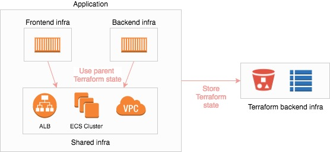

Simple ECS Topology Example
===========================

This example deploys a containerized application on Amazon Elastic Container Service (ECS) using Terraform.



**Prerequisites**

* [Terraform installed](https://www.terraform.io/intro/getting-started/install.html)
* [AWS CLI installed](https://docs.aws.amazon.com/cli/latest/userguide/installing.html)
* [Named AWS CLI profile configured](https://docs.aws.amazon.com/cli/latest/userguide/cli-multiple-profiles.html), which will be referred to as **PROFILE**   

```bash

cd ecs/simple-topology

./create-backend.sh PROFILE

./create-env.sh dev PROFILE

```
